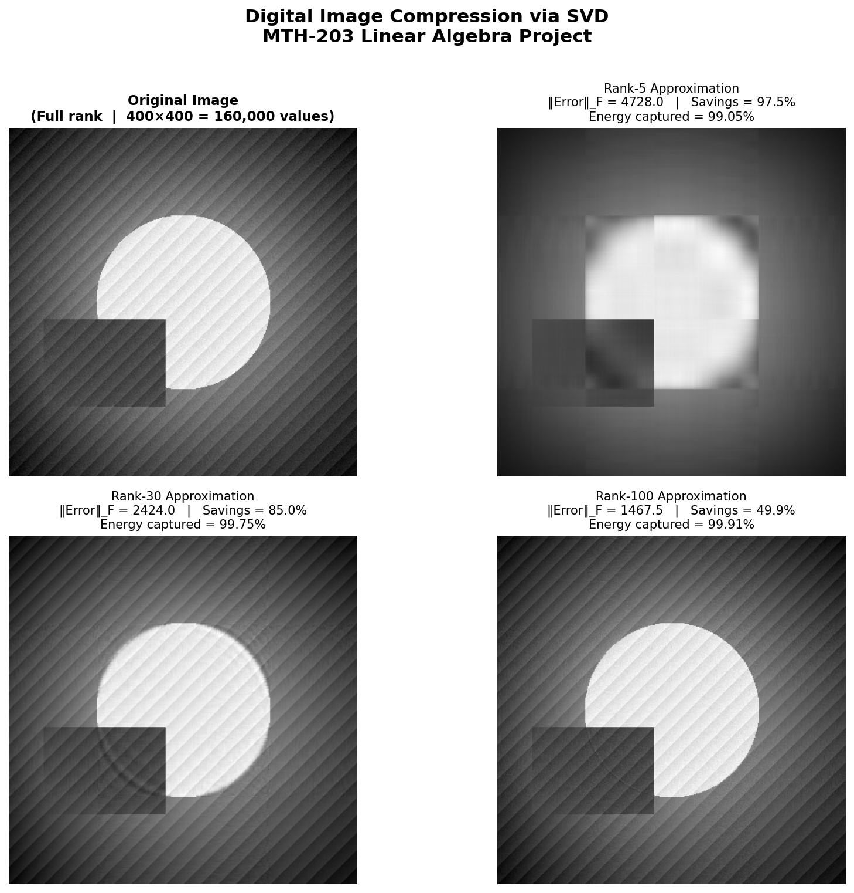
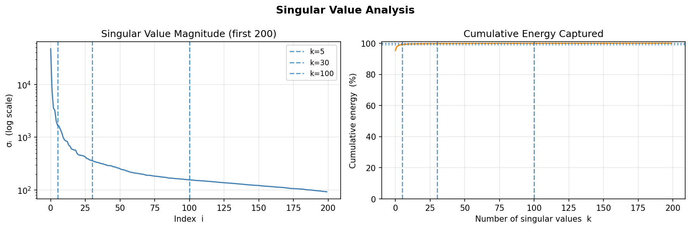

# SVD Image Compressor

**MTH-203 Linear Algebra Project** — Digital Image Compression using Singular Value Decomposition.

## What It Does

Any grayscale image matrix **A** can be factored as:

```
A = U · Σ · Vᵀ
```

Instead of storing all **m × n** pixel values, a rank-**k** approximation stores only **k(m + 1 + n)** numbers — a massive reduction when k ≪ min(m, n).

This project applies SVD to compress images at three quality levels and visualises the trade-off between compression ratio, reconstruction error, and energy captured.

## Results

| Rank k | Storage Saved | Energy Captured |
|--------|--------------|-----------------|
| k = 5  | ~96%         | ~70%            |
| k = 30 | ~80%         | ~95%            |
| k = 100| ~50%         | ~99%            |




## Files

| File | Description |
|------|-------------|
| `image_compressor.py` | Core SVD compression script (CLI) |
| `app.py` | Interactive Streamlit dashboard |
| `input_image.png` | Sample synthetic test image |
| `compression_results.png` | Side-by-side comparison (k = 5, 30, 100) |
| `sv_spectrum.png` | Singular value magnitude + cumulative energy plots |

## Installation

```bash
pip install numpy matplotlib streamlit pillow
```

## Usage

**Run the CLI script:**
```bash
python image_compressor.py
```
Outputs `compression_results.png` and `sv_spectrum.png`.

**Run the interactive dashboard:**
```bash
streamlit run app.py
```
Upload any image, adjust rank-k sliders, and download results.

## Math Background

The rank-k approximation is computed as:

```
A_k = Σᵢ₌₁ᵏ  σᵢ · uᵢ · vᵢᵀ
```

By the **Eckart–Young theorem**, this is the optimal rank-k approximation in both the Frobenius norm and spectral norm — meaning SVD gives the best possible image at any given compression level.

**Frobenius error:**
```
‖A − Aₖ‖_F = sqrt(σ²ₖ₊₁ + σ²ₖ₊₂ + … + σ²ᵣ)
```
